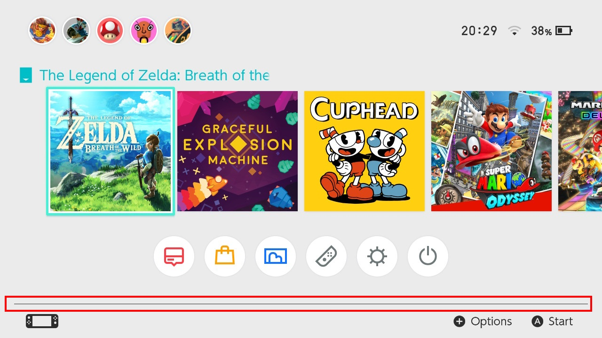

##### :octicons-arrow-left-16: [Back common.szs](../index.md)

#LineFooter.bflyt

**File:** `common.szs/blyt/LineFooter.bflyt`

---

## Layout of `common.szs/blyt/LineFooter.bflyt`

<!-- prettier-ignore -->

## Tree

-	**RootPane [pan1]**
	-	**P_Line [pic 1]** `Line in the footer; Visible: True/False`
