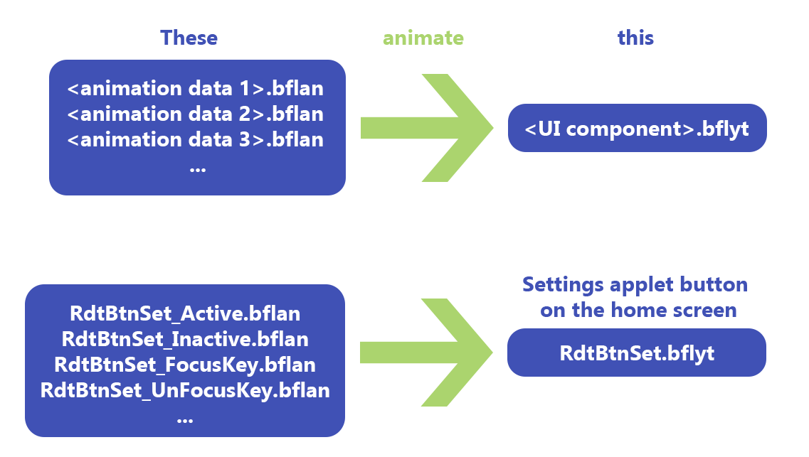

# Animations: refresher course on files and diffing
---

## Quick reminder on Nintendo Switch files

!!! info
        For more details, see the following sections:
        
        - **[Menu files](../menu-files.md) :octicons-arrow-right-16:**

        - **[Filetypes](../filetypes.md) :octicons-arrow-right-16:**

Making themes means altering `.szs` files. Those are archives that contain the UI's graphical assets, all of them being
stored in `.bflyt` and `.bflan` files. Basically, the whole UI is broken down into such files. So in order to create
animations, we'll obviously need to tamper them.

Pictures, icons, text, and pretty much everything displayed on your console screen are *pane* objects that are contained
in `.bflyt` files. These `.bflyt` files also contain information on panes' position/size/scale and their RGBA channels.
In other words, those panes are what we will mess around with in this tutorial, **i.e. they are precisely the objects on
which we will attach our animations.** So you might want to **check beforehand the**  `.bflyt`  **file that contains the
pane you want to animate.**

In practice, **we'll essentially be focusing on**  `.bflan`  **files**, in which are stored parts of the animation data
**for a specific**  `.bflyt`  **file**. Almost all the process is done through Switch Layout Editor which I'll start to
introduce in the next subsection.

Getting back to `.szs` archives, you'll find those in `themes/systemData` on your SD card, these have already been
extracted by the NXTheme Installer homebrew app. Please note that `.szs` files contain copyrighted stuff, making them
illegal to share (that's the reason why modders implemented the `.nxtheme` format to get around this).

Each file corresponds to a specific menu,

| `.szs` file        | Menu                         |
|:--------------------:|:------------------------------:|
| `ResidentMenu.szs` | Home screen                  |
| `Set.szs`          | Settings                     |
| `Psl.szs`          | Player selection             |
| `Flauncher.szs`    | All software / full launcher |
| `Lock.szs`         | Lock screen                  |
| `MyPage.szs`       | User page                    |

so if one wants to edit UI elements on the home page, we would need to grab the `ResidentMenu.szs` file. Likewise, if we
want to make edits to the all apps section, `Flauncher.szs` is the file we will be working with. You get the idea.

!!! info
      You will also find in `themes/systemData` other `.szs` files that aren't listed here, e.g. `Option.szs`. 
      Those are not officially supported by the theme injector, but it is possible to manually edit them regardless. Check out LayoutDocs' [diffpatching section](../diffing.md).

## Diffing with Layout Editor

!!! info
        For more details, see the following section:
        
        - **[Diffing](../diffing.md) :octicons-arrow-right-16:**

You should be used to messing around with `.json` files and compiling themes with Switch Theme Injector, but maybe
you're not familiar with Switch Layout Editor. Think of it as a `.szs` reader/archiver that also offers an actual
on-screen preview of the panes' positioning, which is quite convenient for layout editing. It turns out that Layout
Editor is also used for animation editing.

!!! tip
      Alternatively, you can use Switch Toolbox (also included with [LayoutKit](https://github.com/ThemezerNX/LayoutKit)), which is another piece of software that has pretty much the same purposes as Layout Editor, at least for our current needs. However, since I've been working with Layout Editor, I won't be covering Switch Toolbox here, but at the end of the day it's up to your preference.

Once the animations have been implemented, we'll need to make a *layout diff* (as in *difference*). Basically, we want
to work with two versions of the `.szs` file of interest: the first one stays untouched and the second one will contain
all the edits that have been made through Layout Editor. Layout diffing is the process of comparing (*diffing*) both
these `.szs` files and spitting out a `.json` layout that reflects all your edits. The output `.json` file can then be used in Switch Theme Injector to compile
the `.nxtheme` as you would normally do.

## In summary

We'll go through these general steps that apply for **any type of animation editing**:

- make two copies of the picked `.szs` file

- edit one of them with our animations

- layout diffing

- compile the `.nxtheme` using the output/diffed `.json` and install onto the console (usual process with Switch Theme Injector and NXTheme Installer)

With all of that being introduced, we can finally start creating animations.