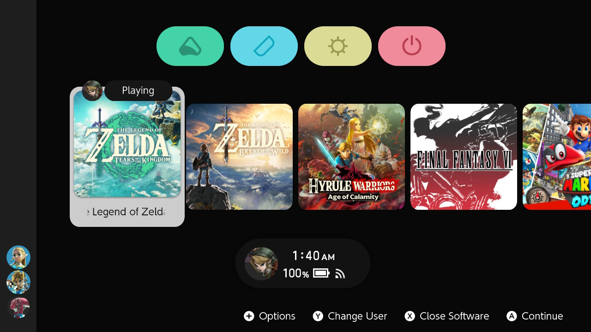

##### :octicons-arrow-left-16: [Back to Filetypes](../filetypes.md)

# Creating custom animations for your NX themes
_Written by [Capybara](https://themezer.net/creators/382997176307154945), revisioned by Migush. Last updated: June 2023_

---

!!! info
      While this guide provides a fair amount of information about animations, there is always room for additional resource as things still aren't fully documented. Feel free to contribute either by [submitting a pull request on github](https://github.com/ThemezerNX/LayoutDocs) or by simply reaching out to the [Themezer Discord](https://discord.com/invite/nnm8wyM).

## Introduction

In this tutorial, we'll see how to implement custom animations to NX themes. This isn't a trivial topic and I expect you
to have minimum knowledge on how the console's UI is organized, how layouts work and how to use Switch Theme Injector.
All the basics should be covered in LayoutDocs' previous sections.

We can distinguish two "main" types of animations:

- Animations made using the **3 basic transformations: translation (linear displacement), scaling and rotation**. It
sounds rather minimalistic but, in fact, you achieve pretty much anything with these, in the end it's up to your own
creativity.
- Color based animations, which also include transparency.

There are some more types but for the sake of pedagogy, I'll elaborate on the animation creation process by going through one easy example. In case
you want to expand your possibilities, additional documentation and [tables](#tables) with the values you'll be needing will be provided later on in this
tutorial, so you can try them out by yourself.

You can have a glance at [my Themezer profile](https://themezer.net/creators/382997176307154945) for examples. If you
want to witness theming at its maximum potential, you might want to
check [NSX's work](https://www.youtube.com/channel/UCtvgkpsXAGp0P3dJr6buxRg) out. Most of his themes still work on
firmware 15.x (it also should on 16.x), but some might glitch, and they likely won't be updated since NSX is sadly
not active in the scene anymore.

|                                                                               |                                                                                                                                                     |
|:----------------------------------------------------------------------------------------------------------------------------:|:------------------------------------------------------------------------------------------------------------------------------------------------------------------------------------------------------------:|
|                                                    **Mod AnimNX** by NSX                                                   |                                                                     **[Unison R](https://themezer.net/packs/Unison-R-5fc)** by me                                                                    |
| The cursor changes its shape in a looping animation, growing animation on game & applet icons on hover, among other features | Unlocking the console into the home screen triggers a zoom out+fade in animation, drop down animation for game titles, color changing buttons on hover, among other features |

## Requirements

- As I mentioned, a minimum knowledge on layouts is mandatory. Be sure to **carefully** read the documentation found
  on [LayoutDocs](https://layoutdocs.themezer.net/) before going any further. While I'll be doing a quick refresher
  course, it would be too long to extra elaborate those subjects here.

- Windows 10 or 11

- [Switch Theme Injector + NXTheme Installer](https://github.com/exelix11/SwitchThemeInjector/releases) to compile and
  install your theme

- [Switch Layout Editor release 15](https://github.com/FuryBaguette/SwitchLayoutEditor) to make animations and check the console's
  files

- A text editor. [Visual Studio Code](https://code.visualstudio.com/download) highly recommended.

Make sure you download the latest version for each aforementioned software.

## Guide structure

Here is the general structure of this guide:

- **Introduction part:** introducing animations and quick refresher course on Nintendo Switch files

- **Main tutorial:** animation creation process

- **Extras:**
    - **Animation templates:** speeding up the process, making color based animations
    - **More on animations:** additional notes, looping animations, animated backgrounds
    - **Tables:** to experiment further and expand animation possibilities

# [Continue to Animations: refresher course](refresher.md) :octicons-arrow-right-16:

---

## Special thanks

- exelix and Migush for all the tips
- Zhi for the animated background testing part
- All the contributors from the Nintendo Switch modding scene

## Additional guides

Check out these guides for more info on how to create animations:

- [This tool guide](https://github.com/KillzXGaming/Switch-Toolbox/wiki/BFLYT-Editing#animations) shows how you can create
animations.  
- [This guide](https://www.reddit.com/r/NXThemes/comments/biu5hc/making_your_own_custom_animations/) shows how you have to
implement the groups so that the animations work with the Switch Theme Injector
-   [Making your own custom animations](https://www.reddit.com/r/NXThemes/comments/biu5hc/making_your_own_custom_animations/)
-   [Importing Animations to your own Layout from another theme](https://www.reddit.com/r/NXThemes/comments/biti3d/importing_animations_to_your_own_layout_from/)
-   [Importing Animations using the SwitchLayoutEditor](https://www.reddit.com/r/NXThemes/comments/bkb5ix/importing_animations_using_the_layout_editor/)
- [Zhi's Patterns theming guide](https://github.com/zzzribas/Patterns/wiki): a specific approach on animated backgrounds