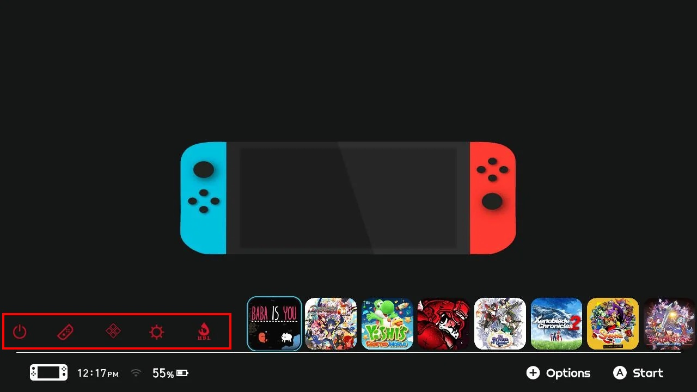

  
_[Simple Homescreen](https://www.reddit.com/r/NXThemes/comments/ba5o8i/rainbow_simple_homescreen_with_rounded_icons_and/) by akaisora255_

---

The NXTheme format has support for custom [applet button](../../../definitions.md#applet-button) icons.  
As you can see in the preview above, the album icon is replaced with a flame.

<!-- prettier-ignore -->
!!! Tip
	Custom icons can be mixed with [custom applet colors](../custom-element-colors/index.md).

## Example

1. Create a custom icon. This icon has to be:
    - `64x56px`
    - white with a transparent background
    - a `PNG` (optionally, `DDS` is supported as well)
2. Open the Switch Theme Injector application and go to the 'NXTheme Builder' tab.
3. Make sure you've selected 'Home menu' in the dropdown, or 'Lockscreen' if you want to change the lockscreen icons.
4. In the box on the bottom, labeled 'Home menu optional settings', you can click any of the buttons next to 'Custom applet icons' to select the png image for the applet button you want.
