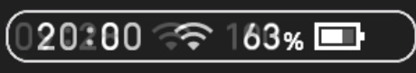

# Disabling Hud Movement Caused by Battery



---

Some layouts separate the clock from other hud elements (for example [Doge Layout](https://themezer.net/layouts/homemenu/Doge-Layout-e)).
By default, the position of the clock changes depending on the battery percentage.
These are the default padding values between the network indicator and the battery icon:


-   `0` (px): battery percentage disabled
-   `32` (px): battery is ≤9%
-   `48` (px): battery is ≥10% and ≤99%
-   `64` (px): battery is 100%

## Example Code

```json
{
	"TargetName": "ResidentMenu.szs",
	"Files": [
		{
			"FileName": "blyt/Hud.bflyt",
			"Patches": [],
			"AddGroups": [
				{
					"GroupName": "G_BatteryNumCustom",
					"Panes": ["N_BatteryNum"]
				}
			]
		}
	],
	"Anims": [
		{
			"FileName": "anim/Hud_BatteryNum.bflan",
			"AnimJson": "{\"LittleEndian\":true,\"Version\":150994944,\"pat1\":{\"AnimationOrder\":3,\"Name\":\"BatteryNum\",\"ChildBinding\":10,\"Groups\":[\"G_BatteryNumCustom\"],\"Unk_StartOfFile\":0,\"Unk_EndOfFile\":0,\"Unk_EndOfHeader\":\"AA0AAAAAAA==\"},\"pai1\":{\"FrameSize\":3,\"Flags\":0,\"Textures\":[],\"Entries\":[{\"Name\":\"N_BatteryNum\",\"Target\":0,\"Tags\":[{\"Unknown\":0,\"TagType\":\"FLPA\",\"Entries\":[{\"Index\":0,\"AnimationTarget\":8,\"DataType\":2,\"KeyFrames\":[{\"Frame\":0.0,\"Value\":64.0,\"Blend\":0.0},{\"Frame\":1.0,\"Value\":64.0,\"Blend\":0.0},{\"Frame\":1.0,\"Value\":64.0,\"Blend\":0.0},{\"Frame\":2.0,\"Value\":64.0,\"Blend\":0.0},{\"Frame\":2.0,\"Value\":64.0,\"Blend\":0.0},{\"Frame\":3.0,\"Value\":64.0,\"Blend\":0.0},{\"Frame\":3.0,\"Value\":64.0,\"Blend\":0.0}],\"FLEUUnknownInt\":0,\"FLEUEntryName\":\"\"}]}],\"UnkwnownData\":\"\"}]}}"
		}
	]
}
```

This example code modifies the default values and sets them all to `64`, meaning the hud won't shift anymore depending on battery percentage. These values are stored in an animation: `Hud_BatteryNum`.

The `AddGroups` part makes sure the `Hud.bflyt` actually uses the new animation.
